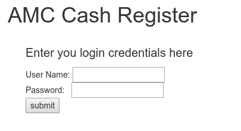
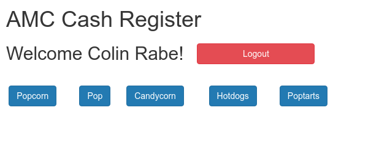
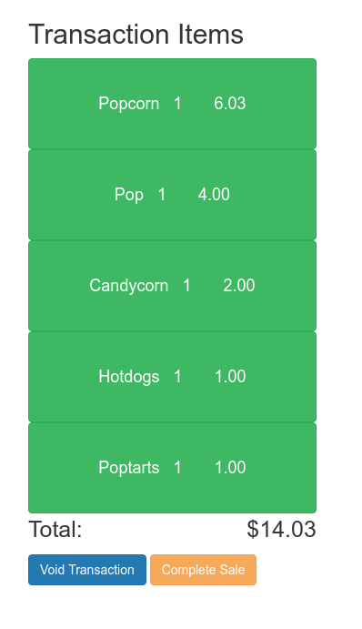
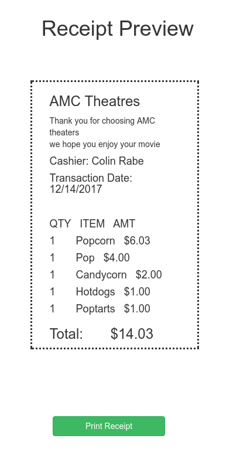

# Cash Register User Manual

Before you are able to operate the register, please make sure you have contacted
a manager about putting your credentials into the system. In case the program
is required to be restarted, the register url can be found at `http://localhost:1337`.

The first screen you will encounter is the login page, where you can enter
your employee credentials.

If you accidently enter the wrong username and password combo, a message will
appear explaining the error. Once you have logged into the system, you will
see that there are two main sections of the interface, an array of buttons,
and a (most likely empty) area where items in a transaction will appear.
The button array will look like this:

The buttons with items on them correspond to what a customer would like to purchase. Every
time you press one of the buttons, the quantity of the item being sold in the transaction
will go up by one. For instance, if a customer would like to purchase three sodas, you would
press the button labled "pop" three times. The logout button will log you out from the
system, but will save the items in the current transaction.

The other side of the screen will show the list of items. Here is what it looks like
when there are items in a transaction:

Each item is actually a button you can press to remove that item (and all of its quantity)
from the current transaction. This is so that if you accidently press one of the earlier
buttons one too many times, you can just press the green button to remove it from the 
transaction and enter the correct amount without needing to restart the entire transaction.
The total for the transaction will appear below the list of transactions. If you would like
to cancel an entire transaction, you can press the "Void Transaction" button at the bottom
of the list so you can start over. Once you have finished a transaction, you should press
the "Complete Sale" button so that the transaction can be archived.

After you press the "Complete Sale" button, you will be greeted with this screen:

The screen will display a preview of the receipt that will be printed for the customer.
The rest of the buttons on the register are hidden so that the receipt can't be altered after the transaction has already completed.
When you are satisfied that the details appear correct, you can press the "Print Receipt"
button at the bottom of the page. You might be wondering why the system itself 
can't verify that the reciept is properly formatted so you don't have to click extra
buttons, and the answer is that we don't pay our R&D division enough to think about these
kinds of things.

If for some reason the system encounters an error, it should display information
about it in red text in the bottom left hand corner of the screen.

If it isn't obvious what is causing an error, we recommend contacting your manager or administrator.

# For Administrators

* Administration Credentials

`username`: testy_pete

`password`: institutional_paisley

* API Commands

The base API url which must be preappended to all commands is `localhost:1337`
If the command url contains an underscore character, it means a parameter is expected in its place.

`/void` Truncates the `transaction` table in the database. Nothing to display on screen.

`/buttons` Returns a JSON list of the HTML and CSS rules from `till_buttons` in the database.

`/items` Returns a list of the current records inside the `transaction` table in the database.

`/click?id=_&username=_` Takes an id# of an item (default 1-5) and a plain text username from the `users` table
(one of rabex028, fossx229, or testy_pete). Will insert one record into the `transaction` table with the appropriate userID, itemID, and corresponding price and item name OR increment the quanity of an item by one if the item is already in the table. Causes strange records to appear if other values than the ones listed are inputed instead... Doesn't display anything on the screen.

`/itemclick?id=_` Takes an id# of an item. If the given id# matches an itemID in the `transaction` table, it will be removed
(along with all of its quantity) from the table. Doesn't display anything on the screen.

`/login?username=_&password=_` Takes a username and a password. If BOTH the given username and password match a username and password
combo in the `users` table, then this command will return the employee_name that corresponds to the as JSON. Otherwise, an empty
array will be returned.

`/sale` Calls the `archive_transaction` procedure, which can also be viewed in the repo. For each record in the `transaction` table, it will insert into the `item_archive` table the transactionID (which is determined from the previous IDs in the `archive` table...),
the itemID that corresponds to each record, as well as its quantity, price, and quantity x price (subtotal). It will then insert one
record into the `archive` table with the same transactionID as was inserted into the `item_archive`, the earliest time that can be found in the `transaction` table as the start time, an endtime that was created when the procedure was called, the difference between the
endtime and the starttime as the duration (in seconds), the userID who made the transaction, and the total for the transaction.

* Table Appendix

This is a list of all of the tables which interact with the point of sales system:

`till_buttons` Gets the styling information for the buttons, and also provides the id numbers of the items that link up elsewhere in the database. Gets the prices of the items too from the `prices` table.

`prices` Provides the prices of the items which correspond to the itemIDs as a foreign key.

`inventory` Does not actually interact with the system, but is what the items are based on and still has a foreign key link (no constraints).

`transaction` Stages the items in a transaction before they are archived. If we could start over, we think we would insert a record
for each time a button is clicked instead of incrementing the quantity on a duplicated key insertion, but our front end was too dependent to redesign at that point.

`archive` Archives the total of a transaction, the start time, end time, duration, userID, and gives the record itself a transactionID. Inserts one record per each completed transaction. Very closely models the `transactionSummary` View stipulations... but doesn't actually specify the user's name who completed the transaction. We chose instead to go with a more normalized version of an archive, in part because of how we are handling quantity.

`item_archive` Keeps track of the indvidual itemID's and their quantities, prices, and subtotals from transactions. Has a foreign
key of transactionID that is given to each record (item) in a transaction. Keeps track of price for archival purposes, though it could also be deduced from subtotal and quantity.

`users` Stores the employee information for the register. Provides the userID as a foreign key for the transaction and
archive tables so that employees who made the transactions can be identified. Also handles logging in users to the register system
by storing usernames and passwords.

